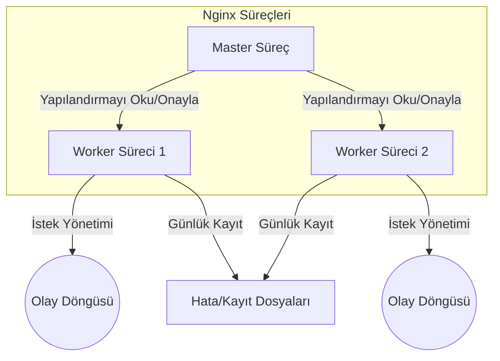

# Nginx  
## Tanım ve Kullanım Amacı  
Nginx (“engine x”), yüksek eşzamanlılık, düşük bellek tüketimi ve yüksek performansa odaklanmış, açık kaynaklı bir HTTP sunucusu, ters vekil sunucusu ve yük dengeleyicisidir. Apache gibi geleneksel sunuculara göre olay-tabanlı (event-driven) bir mimari kullanır, bu sayede yavaş istemcilerle iletişimde bile binlerce bağlantıyı az kaynakla sürdürebilir. Nginx’in başlıca kullanım alanları şunlardır:  
- **Statik içerik sunma:** HTML, CSS, resim vb. dosyaları çok hızlı sunar.  
- **Ters vekil/proxy (Reverse Proxy):** İç ağdaki sunucuların arkasına yerleştirilerek istemcileri yönlendirir ve arka uç sunucuların yükünü hafifletir.  
- **Yük dengeleme (Load Balancing):** Birden çok sunucu arasında trafiği paylaştırarak yüksek erişilebilirlik sağlar.  
- **Önbellekleme (Caching):** Dinamik içerikleri veya sık erişilen kaynakları önbelleğe alarak yanıt süresini iyileştirir.  
- **SSL/TLS Desteği:** Güvenli bağlantılar için TLS/SSL terminasyonu yapabilir.  
- **TCP/UDP Proxy:** HTTP dışında diğer protokoller (ör. TCP tabanlı veri akışları, SMTP/IMAP e-posta proxy’si) için de proxy olarak kullanılabilir.  

Nginx, günümüzde dünya genelinde milyonlarca web sitesinin (Netflix, Dropbox, WordPress.com vb.) temelini oluşturur. Örneğin WordPress’in resmi sitesi WordPress.org da Nginx üzerinde çalışır.  

## Tarihçe ve Kaynaklar  
Nginx, 2002’de Igor Sysoev tarafından geliştirilip 4 Ekim 2004’te ilk kez yayımlandı. Yazar Apache’nin her istek için yeni işlem/iş parçacığı açan mimarisini iyileştirmek üzere olay tabanlı bir tasarım benimsedi. 2012’den itibaren F5 şirketi Nginx’i satın alarak kurumsal sürüm (NGINX Plus) ve topluluk sürümü geliştirmelerine devam etti. Nginx dağıtımı 2- madde BSD benzeri lisansla sunulur.  
    

## Mimarisi ve Temel Bileşenler  
Nginx mimarisi **çoklu süreç (multi-process)** şeklindedir. Bir adet **master** süreç ve **birden çok worker (işçi)** süreci bulunur. Tüm süreçler tek iş parçacıklıdır (tek iş parçacıklı, tek thread) ve paylaşılan bellek kullanarak birbirleriyle haberleşir. Master süreç; yapılandırmayı okuma/denetleme, soket oluşturma/bağlama, worker süreçleri başlatma/durdurma gibi yönetim işlerini üstlenir. Worker süreçleri ise gelen istemci bağlantılarını kabul edip HTTP isteklerini işler, proxy yapar, filtre uygular vb. günlük taleplerle ilgilenir. 

Nginx’in temel yapı taşları:
- **Olay Döngüsü (Event Loop):** Worker süreçleri olay döngüsü mekanizması kullanarak bağlantı isteğini asenkron şekilde işler. Linux üzerinde genellikle `epoll` (veya FreeBSD’de `kqueue`) gibi etkin bekleme yöntemleri kullanılır. Bu sayede her bağlantı için yeni bir thread/süreç açmak yerine tek bir süreç ile binlerce bağlantı yönetilebilir.  
- **Modüler Yapı:** Nginx çekirdeği (core) üzerine dinamik veya statik modüller eklenebilir. HTTP sunucusuna özgü modüller (ör. ngx_http_proxy_module, ngx_http_rewrite_module), stream protokollerine yönelik modüller (TCP/UDP proxy) ve çekirdeğe dahil diğer modüller mevcuttur.  
- **Paylaşılan Bellek:** Worker süreçleri gerekli yapılandırma verilerini paylaşılan bellek ile kullanır, böylece tekrar fork edilmeleri aşamasında konfigürasyon hemen erişilebilir hale gelir. Ayrıca proxy cache metadata’sı gibi bilgiler de paylaşılan bellekte saklanır.  
- **Yapılandırma (Configuration):** İnsan tarafından anlaşılır C-benzeri düzende (bloklar ile iç içe) yazılmış metin dosyalarından (`nginx.conf` ve ek olarak dahil edilen dosyalar) oluşur. Master süreç bu dosyaları okur, doğrular ve statik hale getirip worker’lara aktarır. Konfigürasyon blokları `events`, `http`, `server`, `location` gibi farklı kapsamlar içerir. Örneğin bir **server** bloğu, sanal ana bilgisayar (virtual host) ayarlarını, **location** bloğu ise URI yönlendirme kurallarını belirler.

Aşağıda Nginx’in proses yapısını basitleştirilmiş bir diyagramla gösteren bir mermaid akış diyagramı örneği bulunmaktadır:



Yukarıdaki şemada **Master Süreç**, Nginx’in “root” kullanıcısında çalışan tek otorite sürecidir. Master, konfigürasyonu yükler ve örneklediği “worker süreçleri”ne yönlendirir. Her worker kendi olay döngüsü içinde istemciden gelen bağlantıları işler. Cache loader ve cache manager gibi ek Nginx süreçleri de özel amaçlar için bulunmaktadır.

## Avantajlar ve Dezavantajlar

| Avantajlar | Dezavantajlar |
|------------|--------------|
| Düşük bellek ve CPU kullanımı, binlerce eşzamanlı bağlantıyı az kaynakla yönetebilme. | Kapsamlı modul ekosistemi Apache kadar geniş değildir. Özellikle Apache’ye özgü `.htaccess` gibi dosya düzeyinde yapılandırma desteği yoktur. |
| Olay-tabanlı, çok hızlı, statik içerik sunmada yüksek performans. | Apache’ye kıyasla daha küçük bir topluluğa sahiptir, dolayısıyla sorunlara çözüm bulmak daha zor olabilir. |
| Yüksek esneklik: ters proxy, load balancing ve caching gibi gelişmiş özellikleri native olarak sunar. | Yeni başlayanlar için konfigürasyon dili alışılmışın dışında olabilir; karmaşık yönlendirme kuralları ve regex kullanımı kafa karıştırıcı olabilir. |
| Kolay ölçeklenebilirlik: konfigürasyonu güncellemeden (sıfırlamadan) worker süreç sayısını değiştirebilme. | Ölçeklendirme için genellikle dış araçlar (ör. Kubernetes, Docker) veya Nginx Plus gibi ticari ek bileşenler gerekir. |
| Aktif olarak geliştirilen ve güncellenen bir projedir; topluluk ve profesyonel sürümle desteklenir. | İlk kurulumda ek modüller (ör. gRPC, Redis cache) manuel derleme veya paket ekleme gerektirebilir. |

## Kurulum ve Yapılandırma Örneği  

**Ubuntu/Debian (APT ile):**  
```bash
sudo apt update && sudo apt install nginx
```
Komutuyla Nginx kurulur (Debian 10+ ve Ubuntu LTS sürümlerinde Nginx, varsayılan depoda mevcuttur). Kurulumdan sonra:  
```bash
sudo systemctl start nginx
sudo systemctl enable nginx
```
komutlarıyla hizmet başlatılır ve otomatik başlatma etkinleştirilir. Kurulum tamamlandığında `sudo nginx -t` ile konfigürasyon testi yapılıp `sudo systemctl restart nginx` ile yeniden yüklenebilir.

**CentOS/RHEL (YUM/DNF ile):**  
```bash
sudo yum install nginx         # veya CentOS 8+/Fedora için 'dnf' kullanılabilir
```
komutu ile Nginx yüklenir. Ardından `sudo systemctl start nginx` ve `sudo systemctl enable nginx` ile hizmet aktif edilir. CentOS/RHEL için resmi `nginx.org` deposunu eklemek de tavsiye edilir.

**Temel Sunucu Bloğu Örneği (WordPress Örneği):** Aşağıdaki örnek, bir WordPress sitesini `/var/www/html/wordpress` dizininde barındıran, `example.com` için basit bir server bloğudur:  
```nginx
server {
    listen 80;
    server_name example.com www.example.com;
    root /var/www/html/wordpress;
    index index.php index.html;

    location / {
        try_files $uri $uri/ /index.php?$args;
    }

    location ~ \.php$ {
        include snippets/fastcgi-php.conf;
        fastcgi_pass unix:/run/php/php-fpm.sock;
    }

    location ~ /\.ht {
        deny all;
    }
}
```
Bu yapılandırma: gelen isteklerde gerçek dosya yoksa `index.php`’ye yönlendirir, `.php` dosyalarını PHP-FPM ile işler, `.ht*` gibi gizli dosyalara erişimi engeller. (Ubuntu’da `snippets/fastcgi-php.conf`, CentOS’ta `/etc/nginx/fastcgi.conf` yolu farklı olabilir.) Her değişiklik sonrası Nginx `sudo nginx -t` ile test edilmeli ve `sudo systemctl reload nginx` ile yeniden yüklenmelidir.

## Nginx + WordPress + MariaDB Birlikte Çalışma  
Nginx, PHP tabanlı bir CMS olan WordPress’i web sunucusu olarak sunarken, veritabanı olarak MySQL/MariaDB’yi kullanır. Yaygın “LEMP” yığını şöyle çalışır:  
- İstemci tarayıcı HTTP isteği gönderir.  
- Nginx, gelen isteği uygun bir `server` bloğuna yönlendirir. Statik dosya ise direkt gönderir; dinamik içerik (PHP) ise PHP-FPM işlemine aktarılır.  
- PHP-FPM, WordPress kodunu çalıştırarak veri tabanından içerik talep eder.  
- MariaDB, PHP-FPM’den gelen SQL sorgularını işler ve sonuçları döndürür.  
- WordPress PHP kodu gelen sonuçları HTML’ye dönüştürür, Nginx ise yanıtı istemciye iletir.  

```mermaid
flowchart LR
    client[{"Kullanıcı (Tarayıcı)"}] --> nginx[Nginx Sunucusu]
    nginx --> php["PHP-FPM & WordPress Kodları"]
    php --> db[(MariaDB)]
    db --> php
    php --> nginx
    nginx --> client
```

Yukarıdaki diyagramda Nginx, PHP-FPM süreçlerini tetikler; PHP-FPM WordPress çekirdeğini ve eklenti/tema kodunu çalıştırır; MariaDB ise veriyi saklar ve sorgular. Bu etkileşim sayesinde Nginx yüksek trafik altında bile WordPress tabanlı dinamik siteleri verimli biçimde sunar.

## Güvenlik, Performans ve Bakım İyi Uygulamaları  
- **Güncellemeler:** Nginx’in en son sürümünü kullandığınızdan emin olun. Güvenlik yamaları genellikle paket güncellemeleriyle gelir.  
- **Güçlü TLS Ayarları:** SSL/TLS sertifikası ile HTTPS yapılandırırken güncel protokolleri (ör. TLS 1.2+) ve şifrelemeleri kullanın. `ssl_ciphers` tanımları ve HSTS gibi başlık ayarları ekleyerek bağlantıyı sıkılaştırın.  
- **Sınırlamalar (Limitler):** `worker_connections`, `worker_rlimit_nofile` gibi ayarları sunucu kapasitenize göre yapılandırın. İstenmeyen istek saldırılarını önlemek için **limit_conn** veya **limit_req** modüllerini kullanarak eşzamanlı bağlantı veya istek sayısını kısıtlayın.  
- **Kaynak İzleme:** İş yükünü izleyin. Nginx logları (`access.log`, `error.log`) performans sorunlarının ve hataların ilk göstergesidir. CPU/Memory kullanımını izleyin, gerekirse `top`, `htop` veya zamanlanmış `sar`/`vmstat` ile analiz yapın.  
- **Önbellekleme:** Statik içerik için `expires`/`cache-control` başlıkları, dinamik içerik için Nginx’in proxy_cache özelliği veya WordPress önbellek eklentileri (örn. WP Super Cache) kullanarak yanıt sürelerini kısaltın.  
- **Güvenlik Duvarı:** Yalnızca gerekli portları açın (örneğin, HTTP/HTTPS için 80/443). Nginx’in sadece 80/443 dinlemesine izin verip, yönetim portlarına (22, 3306 vb.) dışarıdan erişimi kapatın.  
- **Kullanıcı Hakları:** Nginx master süreci genellikle `root`, worker süreçleri ise `www-data` veya `nginx` gibi yetkisiz bir kullanıcıda çalışır. Çalışma dizinleri, günlük dosyaları ve PHP dizinlerine uygun izinleri vererek asgari izin prensibini uygulayın.  
- **Güvenlik Modülleri:** WAF (ModSecurity vb.) entegre ederek veya basit kurallarla saldırı tespit sistemleri ekleyerek güvenliği artırabilirsiniz.

## Yaygın Sorunlar ve Çözüm İpuçları  
- **Konfigürasyon Hataları:** Nginx yapılandırmasında küçük bir yazım hatası bile servis başlamasını engeller. Her değişiklik sonrası `sudo nginx -t` komutuyla konfigürasyon doğrulaması yapın.  
- **500/502/504 Hataları:** PHP-FPM ile iletişim sorunları genellikle “502 Bad Gateway” hatasına yol açar. PHP-FPM servisinin çalıştığından (`systemctl status php-fpm`) ve `fastcgi_pass` yolunun doğru tanımlandığından emin olun. Timeout veya hafıza sınırlarını (`fastcgi_read_timeout`, `client_max_body_size`) ihtiyaca göre ayarlayın.  
- **403/404 Hataları:** Dosya izinleri veya `try_files` yönergeleri yanlışsa 403 veya 404 hataları alınabilir. Web dizini içindeki dosya sahiplikleri genellikle `www-data:www-data` (Ubuntu) veya `nginx:nginx` (CentOS) olmalıdır. Ayrıca root ve index ayarlarını doğru yaptığınızdan emin olun.  
- **Varsayılan Nginx Sayfası:** Yeni bir `server_name` atadıysanız, DNS/Hosts ayarlarını kontrol edin. Yanlış `server_name` Nginx’in varsayılan blok (genellikle 80 numaralı sunucu bloğu) çalıştırmasına neden olur. `server_name` direktifi doğru girilmiş mi, domaine işaret eden DNS kayıtları güncel mi kontrol edin.  
- **Yüksek Trafik Sorunları:** Yük altında CPU aşırı kullanımı veya bağlantı düşmeleri yaşıyorsanız `worker_processes` sayısını CPU sayısına veya `auto` olarak ayarlayın. Gerekirse önbellek ve gzip sıkıştırma (`gzip on;`) kullanarak trafiği optimize edin.

## Kaynaklar ve Önerilen Okumalar  
- **Resmi Belgeler (İngilizce):** [NGINX Resmi Dökümantasyon](https://nginx.org/en/docs/) (mimari, konfigürasyon, örnekler), [NGINX Admin Guide](https://docs.nginx.com/nginx/admin-guide/) (F5 tarafından desteklenir).  
- **Türkçe Kaynaklar:** Türkçe Nginx belgeleri sınırlı olmakla birlikte Nginx’in Wikipedia sayfası üzerinden temel bilgilere ulaşılabilir. Ayrıca [Crenw Nginx tanıtımı](https://www.crenw.net/blog/nginx-nedir-ve-ne-ise-yarar) gibi güncel blog yazıları yararlı örnekler içerir.  
- **Örnek Makaleler:** LinuxBabe’ın [Ubuntu’da Nginx+WordPress Kurulumu](https://www.linuxbabe.com/) veya DigitalOcean’ın [LEMP WordPress rehberi](https://www.digitalocean.com/community/tutorials) güncel komut ve örnek sağlar. Bunlar Debian/Ubuntu’a yönelik olsa da mantığı CentOS için de uyarlanabilir.  