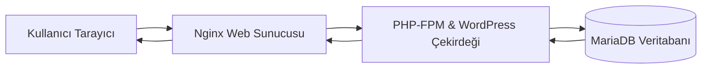

## WordPress  
### Tanım ve Kullanım Amacı  
WordPress, PHP ile yazılmış açık kaynaklı bir **içerik yönetim sistemidir (CMS)**. MySQL veya MariaDB veritabanı ile birlikte çalışır. Başlangıçta sadece blog yayınlama platformu olarak geliştirilen WordPress, zamanla geleneksel blogların yanı sıra haber siteleri, e-ticaret mağazaları, eğitim portalları, üyelik siteleri ve sosyal platformlar gibi pek çok farklı web içeriği türünü destekleyecek biçimde genişletilmiştir. Gelişmiş tema ve eklenti mimarisi sayesinde, kullanıcılar yazılımsal bilgiye sahip olmadan diledikleri görünümü ve işlevselliği web sitelerine kolayca ekleyebilirler. Örneğin WooCommerce eklentisi ile WordPress sitesi kısa sürede çevrimiçi bir mağazaya dönüştürülebilir. Dünya genelinde bilinen tüm web sitelerinin yaklaşık %43,3’ünün, içerik yönetim sistemleri arasında ise %62,8’inin WordPress kullandığı tahmin edilmektedir.  

Başlıca kullanım senaryoları:  
- **Kişisel veya kurumsal bloglar:** İlk adımdan itibaren bloglar için idealdir.  
- **Kurumsal web siteleri:** Şirketler, haber portalları, bakanlıklar, resmi kurumlar.  
- **E-ticaret siteleri:** WooCommerce, Easy Digital Downloads gibi eklentilerle tam teşekküllü mağaza.  
- **Portföy ve blog karma:** Fotoğrafçılar, tasarımcılar vb. kendi çalışmalarını sergilemek için.  
- **Topluluk siteleri:** BuddyPress/BuddyBoss eklentileriyle sosyal ağ veya forum.  

Yaygın olarak kullanılan WordPress.com ve Türkiye’de popüler portallar da WordPress altyapısı kullanmaktadır.  

### Tarihçe ve Gelişim  
WordPress’in kökeni 2003 yılına dayanır. 27 Mayıs 2003’te Matt Mullenweg ve Mike Little, b2/cafelog adlı eski bir projeyi geliştirecek şekilde WordPress’in ilk sürümünü yayınladılar. Başlangıçta yalnızca blog yazısı yayınlamak üzere tasarlanmasına rağmen, aktif bir topluluk desteği ile hızla bir CMS’e dönüştü. Zaman içinde binlerce tema (arayüz), eklenti (plugin) ve çeviri paketi eklendi. Kod tabanı sürekli güncellendi; WordPress Foundation öncülüğünde yayın süreci açık tutuldu. Bugün de en son sürüm (ör. WordPress 6.x) aylık güncellemelerle geliştirilmekte, güvenlik yamaları çıkarılmaktadır.  

### Mimari ve İç Bileşenler  
WordPress’in temel bileşenleri şunlardır:  
- **Çekirdek (Core) Dosyalar:** PHP ile yazılmış ana uygulama kodu. Admin paneli, içerik yönetimi işlevleri, kullanıcı yetkilendirme vb. işlevler burada bulunur.  
- **Veritabanı (MySQL/MariaDB):** Tüm içerik, ayar ve kullanıcı verileri ilişkisel tablolar halinde bu veritabanında depolanır. (`wp_posts`, `wp_users` vb. tablolar.)  
- **Temalar (Themes):** Site görünümünü belirleyen şablonlardır. Kullanıcılar hazır temalar indirerek ya da özel tema geliştirerek web sitelerinin tasarımını tanımlayabilir.  
- **Eklentiler (Plugins):** Özellikleri genişleten PHP paketleridir. Örneğin SEO, güvenlik, performans, iletişim formları, sosyal entegrasyon gibi fonksiyonlar eklenti yoluyla eklenir.  
- **Medya ve Üyeler:** Yüklenen resimler, videolar ve dosyalar `wp-content/uploads` dizininde saklanır. Kullanıcı ve rol sistemi (yönetici, editör, abone vb.) ile siteye erişim ve yetkilendirme kontrolü yapılır.  
- **Yönetim Paneli:** Web tarayıcı tabanlı admin arayüzü, kullanıcıların içerik ekleyip düzenlemesini, ayarları yönetmesini sağlar.  

#### Çalışma Akışı Örneği  
Bir kullanıcı tarayıcıdan bir sayfa istediğinde şu adımlar gerçekleşir:  
1. **HTTP İsteği:** Kullanıcı `example.com` gibi bir adresi ziyaret eder.  
2. **Nginx Karşılama:** Nginx, istek URL’sini karşılayıp doğru sanal sunucu (virtual host) bloğuna yönlendirir. Eğer istenen kaynak statik ise direkt sunulur. Eğer dinamikse (`.php` dosyası veya permalink ile WP sayfası), istek PHP-FPM’e aktarılır.  
3. **PHP-FPM ve WordPress:** PHP-FPM, istemci isteğini alıp WordPress’in `index.php` dosyasını çalıştırır. WordPress çekirdeği URL’ye göre hangi içerik istenmişse (ör. bir yazı, sayfa, arşiv) kontrol ederek veritabanından ilgili verileri çeker.  
4. **Veritabanı Erişimi:** WordPress, MySQL/MariaDB’ye SQL sorguları göndererek içeriği (`wp_posts` vb. tablolardan) alır veya kullanıcı doğrulaması yapar.  
5. **HTML Oluşturma:** Alınan veriler, tema şablonlarına yerleştirilerek dinamik HTML’e dönüştürülür. (Örneğin sayfa başlıkları, metinler, resimler vb. bu aşamada eklenir.)  
6. **Yanıtın İletilmesi:** PHP sonucu elde edilen HTML, Nginx üzerinden kullanıcıya gönderilir. Tarayıcı sayfayı görüntüler.  



Bu işleyişte Nginx, gelen istekleri PHP-FPM’e ileterek WordPress’in çalışmasını sağlar. PHP-FPM/MariaDB arasında WordPress çekirdeği veriyi alıp işler. Sonuç olarak ortaya çıkan HTML Nginx tarafından istemciye iletilir.  

### Avantajlar ve Dezavantajlar

| Avantajlar | Dezavantajlar |
|------------|--------------|
| Kullanımı çok kolaydır; kullanıcı dostu bir yönetim paneli ile teknik bilgi az olanlar bile site kurabilir. | Yoğun eklenti kullanımı ve veritabanı erişimi gerektirmesi nedeniyle performans sorunları çıkabilir. (Özellikle yüksek trafik altında) |
| Binlerce **teması** ve **eklenti** ile fonksiyonellik son derece esnek bir şekilde genişletilebilir. (Örn. WooCommerce, Yoast SEO) | Açık kaynak olduğundan güvenlik açıkları görülebilir. Sık güncellenmesi ve güvenlik önlemlerinin alınması gerekir. |
| Büyük bir geliştirici ve kullanıcı topluluğuna sahiptir; dokümantasyon, destek forumları ve eğitim materyali bolca mevcuttur. | Çoğu küçük geliştirici uzun süre WordPress’e alışmıştır; ileri seviye özelleştirmelerde (ör. özel REST API, non-PHP uygulamalar) sınırlamalar olabilir. |
| SEO dostu çıkış yapısı, mobil uyumluluk ve sürekli iyileştirilen arama motoru optimizasyonuna katkı sağlayan kod yapısı sunar. | Bazen güncellemelerde geriye dönük uyumluluk sorunları olabilir; ana çekirdek veya eklenti güncellemeleri tema çökmesine yol açabilir. |
| PHP ve MySQL/MariaDB kullandığı için klasik LAMP/LEMP yığını üzerinde kolayca barındırılabilir. | Bazı popüler CMS’lere göre (ör. Drupal, Django CMS) dosya-tabanlı önbellek ve modülerlik konularında dezavantajlıdır. |

### Kurulum ve Yapılandırma Örnekleri  

**Gereksinimler:** WordPress için bir web sunucusu (Nginx), PHP (sürüm 7.4 veya 8.0+ önerilir) ve MySQL/MariaDB gereklidir. PHP için `php-fpm` ve `php-mysql` (veya `php-mysqlnd`) modülleri yüklü olmalıdır. Örneğin Ubuntu’da:  
```bash
sudo apt update
sudo apt install php-fpm php-mysql
```
CentOS/RHEL 8+ için:  
```bash
sudo yum install php-fpm php-mysqlnd
```

**Veritabanı Oluşturma:** WordPress kurulumundan önce bir veritabanı ve kullanıcı oluşturmalısınız. Örneğin MariaDB konsolundan:  
```sql
CREATE DATABASE wordpress DEFAULT CHARACTER SET utf8 COLLATE utf8_general_ci;
GRANT ALL ON wordpress.* TO 'wp_user'@'localhost' IDENTIFIED BY 'sifre123';
FLUSH PRIVILEGES;
```
(上記 örnek, `wordpress` adlı DB’yi, `wp_user` kullanıcısını ve `sifre123` parolasını oluşturur.)

**WordPress Dosyalarını İndirme:**  
```bash
cd /var/www/html
sudo wget https://wordpress.org/latest.tar.gz
sudo tar -xzvf latest.tar.gz
sudo mv wordpress/* .
sudo chown -R www-data:www-data .   # (CentOS için 'nginx:nginx' olabilir)
```
Çıkarılan dosyalar `wp-config-sample.php` içerir; bu dosyayı `wp-config.php` olarak adlandırıp düzenleyin. En temel ayarlar şöyledir:  
```php
/** MySQL ayarları */
define('DB_NAME', 'wordpress');      // Yukarıda oluşturduğunuz veritabanı adı
define('DB_USER', 'wp_user');        // Oluşturduğunuz kullanıcı adı
define('DB_PASSWORD', 'sifre123');   // Kullanıcı parolası
define('DB_HOST', 'localhost');      // Veritabanı sunucusu (genellikle localhost)
```
(Bu yapılandırma WordPress’in çekirdek `wp-config-sample.php` dosyasından alınmıştır.) Ayrıca `AUTH_KEY`, `SECURE_AUTH_KEY` vb. tanımları [WordPress secret key generator](https://api.wordpress.org/secret-key/1.1/salt/) ile doldurarak güvenliği artırın. Ayarlardan sonra dosyayı kaydedip çıkın.

**Web Arayüzünden Tamamlama:** Nginx ayarlı ise tarayıcıdan sitenizin adresine giderek (“example.com/wp-admin/install.php”), site adı, yönetici kullanıcı adı/parola gibi bilgileri girip kurulumu tamamlayın. Bu adımla WordPress kurulmuş olur. Alternatif olarak WP-CLI kullanarak komut satırından da kurulumu otomatikleştirebilirsiniz.

**Örnek Nginx Sunucu Bloğu (WP):** WordPress için tipik Nginx yapılandırması bir önceki bölümde verilmiştir. Ayrıca `try_files` direktifi WordPress’in “kalıcı bağlantı” (permalink) yapısını destekler. Örnek config’te `location /` bloğu, mevcut dosya yoksa `/index.php` yoluna istemci parametreleriyle tekrar yönlendirme yapar.

### WordPress + Nginx + MariaDB Etkileşimi  
WordPress, PHP ve MySQL/MariaDB kullanan bir uygulama olduğundan Nginx ile en verimli biçimde LEMP (Linux-Nginx-MariaDB-PHP) şeklinde çalışır. Yukarıda tarif edilen akışta (istek → Nginx → PHP-FPM → MariaDB) WordPress tam bir site deneyimini sunar. MariaDB, WordPress’in ihtiyaç duyduğu veritabanı sorgularını (yazı ekleme, kullanıcı yönetimi vb.) işlerken, Nginx sıkıştırma, SSL terminasyon ve önbellekleme gibi işlemleri yerine getirir. Örneğin bir blog yazısı görüntülenirken, Nginx statik içerikleri hızlıca yollarken dinamik PHP kodunu PHP-FPM ile çalıştırır; PHP, MariaDB’den yazı verisini alır. Bu sayede tüm sistem yüksek trafikte bile ölçeklenebilir bir şekilde hizmet verebilir.

### Güvenlik, Performans ve Bakım İyi Uygulamaları  
- **Güncellemeler:** WordPress çekirdeği, tema ve eklentileri güncel tutun. Güvenlik yamaları hızla yayınlandığından düzenli güncelleme şarttır.  
- **Güçlü Kimlik Doğrulama:** Yönetici hesapları için karmaşık parolalar kullanın, 2FA (iki faktörlü kimlik doğrulama) eklentilerini tercih edin.  
- **Yedekleme:** Hem dosya sistemi (wp-content/uploads gibi) hem de veritabanı (MySQL/MariaDB dump) yedeklerini otomatik veya düzenli olarak alın. Beklenmedik arızalarda geri dönüş sağlar.  
- **Güvenlik Duvarı ve İzinler:** Sunucu seviyesinde firewall ile 22, 80, 443 portlarını ayarlayın. `wp-config.php` ve `.htaccess` gibi hassas dosyaların yazma izinlerini kısıtlayın. `wp-content` dışında kalan çekirdek dosyalara mümkünse yazma izni vermeyin.  
- **Önbellekleme ve CDN:** WordPress sitenizi hızlandırmak için sayfa önbelleği (örn. WP Super Cache, W3 Total Cache) kullanın. Büyük medya dosyaları için CDN tercih edin. PHP OpCache, Redis veya memcached ile sorgu önbelleği de ek performans kazandırır.  
- **Veri Tabanı Bakımı:** İhtiyaç halinde `wp_options` tablosunu temiz tutun, eski revizyonları sınırlandırın (ör. `WP_POST_REVISIONS` ile). MariaDB/WordPress veritabanı periyodik optimize edilebilir.  

### Yaygın Sorunlar ve Çözümler  
- **Eklenti/Uyumsuzluk Hataları:** Yeni bir eklenti yükledikten sonra site bozulursa, eklentiyi ftp/SSH ile `wp-content/plugins/` klasöründen silebilir veya yeniden adlandırarak devre dışı bırakabilirsiniz.  
- **Permalink Çalışmıyor:** Kalıcı bağlantı ayarları etkin değilse Nginx `try_files` yönergesini doğru yapılandırdığınızdan emin olun. Yeniden yazma kuralları *.htaccess yerine Nginx konfigürasyonuna işlenmelidir.  
- **Beyaz Ekran (White Screen of Death):** PHP bellek limiti (`memory_limit`), kritik hataları gösterecek `WP_DEBUG` modu veya hataları loglama ile sorunu tanımlamaya çalışın. Genellikle PHP hatasıdır.  
- **Giriş Sorunları:** WordPress girişinde “414 Request-URI Too Large” gibi hatalar, uzun permalink’lerden kaynaklanabilir. Nginx `client_max_body_size` veya `large_client_header_buffers` sınırları artırılabilir.  
- **Şifreli Bağlantı (SSL) Sorunları:** SSL kurulumu sonrası admin panelinde veya site genelinde karışık içerik (mixed content) uyarısı alabilirsiniz. Tüm URL’lerin HTTPS kullandığından emin olun veya `Really Simple SSL` benzeri eklentilerden yararlanın.  

### Kaynaklar ve Önerilen Okumalar  
- **Resmi Belgeler:** WordPress’in [Türkçe ana sayfası](https://tr.wordpress.org/) (görsel anlatım, basit dokümanlar); [WordPress Developer Documentation](https://developer.wordpress.org/) (çeşitli geliştirici kılavuzları, API referansları); [WordPress Destek Forumları](https://tr.wordpress.org/support/) (topluluk çözüm önerileri).  
- **Türkçe Kaynaklar:** Boğaziçi Üniversitesi gibi eğitim sitelerinde yer alan [WordPress tanıtımları](https://boenstitu.com/wordpress-nedir/) veya hosting sağlayıcıların rehberleri (ör. Prehost WordPress kılavuzu) başlangıç için yararlıdır. Bu kaynaklar genellikle örnek ayarlar ve sıkıntılar üzerine durur.  
- **Eklenti/Performans Araçları:** WP CLI (komut satırı aracı) ve [Query Monitor](https://wordpress.org/plugins/query-monitor/) gibi eklentiler, sorunları bulmak için faydalıdır. Ayrıca kod düzeyi konular için [Stack Overflow ve WP StackExchange](https://wordpress.stackexchange.com/) yazılımcı forumları başvurulabilir.  
